I've been working professionally for the better part of a decade on web apps and, in that time, I've had to learn how to use a lot of different systems and tools.
During that education, I found that the official documentation typically proved to be the most helpful.

Except...Postgres.
It's not because the official docs aren't stellar (they are!)--they're just _massive_.
For the current version (17 at the time of writing), if [printed as a standard PDF on US letter-sized paper](https://www.postgresql.org/files/documentation/pdf/17/postgresql-17-US.pdf), it's 3,200 pages long.[^a4_correction]
It's not something any junior engineer can just sit down and read start to finish.

[^a4_correction]: If you print it on A4 paper, it's 3,024 pages; just another reason that standard is better, I guess.

So I want to try to catalog the bits that I wish someone had just told me before working with a Postgres database. 
Hopefully, this makes things easier for the next person going on a journey similar to mine.

Note that many of these things may also apply to other SQL database management systems (DBMSs) or other databases more generally,
but I'm not as familiar with others so I'm not sure what does and does not apply.

## Normalize your data unless you have a good reason not to

Database normalization is the process of removing duplicate or redundant data from a [database schema][database_schema].
For example, say you have a site where users can upload documents and users can subscribe to email notifications when folks view their documents.
If you have a `documents` table, you shouldn't have a `user_email` column on said table:
When a user wants to change their email, you shouldn't have to update the hundreds of rows for all the documents they've uploaded.
Instead, you can have each row in `documents` represent a row in another table (e.g. `users`) with a foreign key (e.g. `user_id`).

If you search for "database normalization" online, you'll find a bunch of results about "1st normal form" and the like.
You definitely don't need to know what each of those ["normal forms"][normal_forms] are,
but [the general process][database_normalization_steps] is good to be familiar with as it can lead you to a more maintainable database schema.

[database_schema]: https://en.wikipedia.org/wiki/Database_schema
[normal_forms]: https://en.wikipedia.org/wiki/Database_normalization#Normal_forms
[database_normalization_steps]: https://en.wikipedia.org/wiki/Database_normalization#Example_of_a_step-by-step_normalization

There are occasions when having redundant data (that is, [denormalizing your schema][denormalizing]) can make sense:
this is typically to make reading certain data faster so it doesn't have to be recomputed every time it's requested.
E.g. you have an application that manages employee shifts at a bakery.
A user might want to see how many hours they've worked so far this year.
To calculate that, you would need to do something like determine the duration of each of their shifts and then sum all of them together.
It might make sense to instead calculate this amount on a regular interval or whenever the number of hours worked changes.
This data can be denormalized within the Postgres database or outside of it (e.g. in a caching layer like Redis).
Note that there is almost always a cost to denormalized data,
whether that's possible data inconsistency or increased write complexity. 

[denormalizing]: https://en.wikipedia.org/wiki/Denormalization

## Follow all the advice from the folks that make Postgres

There's a big list aptly titled ["Don't do this"][dont_do_this] on the official Postgres wiki.
You may not understand all of the things listed.
That's fine!
If you don't understand, then you probably won't make the mistake.
Some suggestions worth highlighting:
1. [Just use the `text` type for all text storage](https://wiki.postgresql.org/wiki/Don%27t_Do_This#Text_storage)
2. [Just use the `timestampz`/`time with time zone` type for all timestamp storage](https://wiki.postgresql.org/wiki/Don%27t_Do_This#Date.2FTime_storage)
3. [Name your tables in snake_case](https://wiki.postgresql.org/wiki/Don%27t_Do_This#Don.27t_use_upper_case_table_or_column_names)

[dont_do_this]: https://wiki.postgresql.org/wiki/Don%27t_Do_This

## Note some general SQL eccentricities
### Saving your pinkies: you don't have to write SQL in all caps

In most documentation and tutorials, you'll see SQL written like so:
```sql
SELECT * FROM my_table WHERE x = 1 AND y > 2 LIMIT 10;
```

The case for SQL keywords does not matter.
That means the snippet above is the same as this:
```sql
select * from my_table where x = 1 and y > 2 limit 10;
```
or this:
```sql
SELECT * from my_table WHERE x = 1 and y > 2 LIMIT 10;
```
As far as I know, this is not specific to Postgres.
Your pinkies will thank you.

### `NULL` is weird

You're probably familiar with `null` or `nil` values from other programming languages.
SQL's `NULL` is not like that.
`NULL` is really more accurately an "unknown".
E.g. `NULL = NULL` returns `NULL` (because it's unknown if one unknown equals another unknown!)
This is true for almost any operator, not just `=`(we'll go through some of the exceptions in a moment):
if one side of the comparison is `NULL`, the result will be `NULL`.

There are a few operators that you can use to compare against `NULL` which don't result in `NULL`:

|Operation|Description|
|---|---|
|`x IS NULL`|returns `true` if `x` evaluates to `NULL`, `false` otherwise|
|`x IS NOT NULL`|returns `true` if `x` does not evaluate to `NULL`, `false` otherwise|
|`x IS NOT DISTINCT FROM y`|the same as `x = y` but `NULL` is treated as a normal value|
|`x IS DISTINCT FROM y`|the same as `x != y`/`x <> y` but `NULL` is treated as a normal value|

`WHERE` clauses only match if the condition evaluates to `true`.
This means that a query like `SELECT * FROM users WHERE title != 'manager'` won't return rows where `title` is `NULL` because `NULL != 'manager'` is `NULL`.

Another useful function when attempting to wrangle `NULL` is `COALESCE`:
`COALESCE` will take any number of arguments and return the first one that is not `NULL`:
```sql
COALESCE(NULL, 5, 10) = 5
COALESCE(2, NULL, 9) = 2
COALESCE(NULL, NULL) IS NULL
```

## You can make `psql` more useful

### Fix your unreadable output
Have you ever done a query on a table with many columns or long values in those columns and the output is basically unreadable?
It's probably because you don't have the pager enabled.
A [terminal pager][wiki_terminal_pager] allows you to view a file (or table, in the case of `psql`) of text by scrolling a viewport around some larger canvas.
Without a pager, it just dumps the text in your terminal, wrapping to a new line wherever it runs out of space.

[wiki_terminal_pager]: https://en.wikipedia.org/wiki/Terminal_pager

`less` is a decent pager available on any Unix-like system.
You can set it as your pager by setting the environment variable in your `~/.bashrc`/`~/.zshrc`/etc.:
```sh
# Use the `-S` option so it truncates long lines for scrolling instead of wrapping them
export PAGER='less -S'
```

Sometimes, even viewing things as a properly formatted table isn't particularly useful, especially with tables with _many_ columns.
For this, you can switch to "expanded" mode with `\pset expanded` (or the shortcut `\x`) in your `psql` session.
If you want to have this as the default, you can add a file called `.psqlrc` to your home directory (i.e. `~/.psqlrc`) and add `\x` to it.
Any time you start up a `psql` session, it'll run all the commands in that file first.

### Clarify ambiguous nulls

It's _very_ important to know when a value is `NULL` in an output, but the default settings don't make that particularly clear.
You can give `psql` a string to output when it's referring to `NULL`.
I have it set to `[NULL]` by running
```psql
\pset null '[NULL]'
```
Any Unicode string is fine!
It's a bit past spooky season, but you can be like my friend [Steven Harman][sharman] and set it to "👻".

[sharman]: https://stevenharman.net

Once again, if you want to have this as the default, you can add a file called `.psqlrc` to your home directory (i.e. `~/.psqlrc`) and add `\pset null '[NULL]'` to it.
Any time you start up a `psql` session, it'll run all the commands in that file first.

### Use auto-completion

`psql`, like many interactive consoles, will allow for auto-completion.
It helps that SQL is a fairly rigid and fairly structured language.
You can just start typing most keywords or table names and hit <kbd>Tab</kbd> and let `psql` fill out the rest:

```sql
-- start typing "SEL"
SEL
-- ^ hit `Tab`
SELECT
```

### Lean on backslash shortcuts

There are a whole bunch of useful shortcut commands in `psql` for looking up stuff, command line editing, and more.

|Command|What it does|
|---|---|
|`\?`|List all of the shortcuts|
|`\d`|Shows list of relations (tables and sequences) as well as said relation's owner|
|`\d+`|Same as `\d` but also includes the size and some other metadata|
|`\d table_name`|Shows the schema of a table (list of columns, including said column's type, nullability, and default) as well as any indexes or foreign key constraints on said table|
|`\e`|Opens your default editor (set as the `$EDITOR` environment variable) to edit your query there|
|`\h SQL_KEYWORD`|Get syntax and link to docs for `SQL_KEYWORD`|

There are a ton of these and the table above only scratches the surface.

### Copy to a CSV

Sometimes, you just want to share the output of a command with someone who wants to put it in Excel or something.
In Postgres, it's actually really easy to copy the output of any query to a CSV on your local machine[^copy_permissions]:

[^copy_permissions]: This avoids having to use the more standard `COPY` statement which unfortunately often requires escalated privileges which you may or may not have access to.

```psql
\copy (select * from some_table) to 'my_file.csv' CSV
```
If you want it to include an initial line with all the column names, you can add the `HEADER` option:
```psql
\copy (select * from some_table) to 'my_file.csv' CSV HEADER
```
For way more information (including how to get it to do the reverse: insert rows from data in a CSV!), check out [the docs on this command][copy_docs].

[copy_docs]: https://www.postgresql.org/docs/current/app-psql.html#APP-PSQL-META-COMMANDS-COPY

### Use column shorthands and aliases

When doing a `SELECT` statement in `psql`, you can re-title each of the output columns to whatever you want (an "alias") with the `AS` keyword:

```sql
SELECT vendor, COUNT(*) AS number_of_backpacks FROM backpacks GROUP BY vendor ORDER BY number_of_backpacks DESC; 
```

This will also rename the column in the output.

What's more is that `GROUP BY` and `ORDER BY` have their own nice shorthand as well:
you can reference output columns by the number they appear after `SELECT`.
Therefore, you can write the previous query as

```sql
SELECT vendor, COUNT(*) AS number_of_backpacks FROM backpacks GROUP BY 1 ORDER BY 2 DESC; 
```

While useful, don't put this in any queries that you ship to production--your future self will thank you!

## It's possible that adding an index will do nothing (particularly if it's misconfigured)

### What is an index?

An index is a data structure intended to help with looking up data--giving Postgres the responsibility of maintaining a "shortcut directory" to a table's rows by various fields.
By far the most common kind is a [B-tree][b_tree] index, which is a kind of search tree that work for both exact equality conditions (e.g. `WHERE a = 3`) as well as range conditions (e.g. `WHERE a > 5`).

[b_tree]: https://www.baeldung.com/cs/b-tree-data-structure

But you can't tell Postgres to use a specific index.
It needs to predict (using statistics it maintains for each table) that it'll be faster than just reading the table from top to bottom to find the relevant data
(known as a "sequential scan" or "seq. scan"--pronounced "seek scan"--for short).
You can see how Postgres is planning on executing a query by adding `EXPLAIN` before your `SELECT ... FROM ...`.
This will give you a "query plan": a plan for how Postgres is going to find the data and its estimate for how much work each task will take.
There are many good guides for reading the output of these query plans like [this one from thoughtbot][thoughtbot_query_plan] or [this one from pganalyze][pganalyze_query_plan].
[The official docs][explain_docs] are also a good reference (albeit a bit overwhelming for a newbie).
For analyzing query plans, I've found [this tool][query_plan_analyzer] to often be very helpful

[thoughtbot_query_plan]: https://thoughtbot.com/blog/reading-an-explain-analyze-query-plan
[pganalyze_query_plan]: https://pganalyze.com/docs/explain
[explain_docs]: https://www.postgresql.org/docs/current/using-explain.html
[query_plan_analyzer]: https://explain.depesz.com/

### An index isn't much use for a table with barely any rows in it

This is particularly important when doing development on your local database.
Chances are, you don't have millions of rows in your local database.
Postgres may find that it's faster just to do a seq. scan rather than use the index at all if it's just dealing with 100 rows.

### When indexing multiple columns, the order matters

Postgres supports multicolumn indexes which do what you might expect:
if you create an index on columns `a` and `b` like so:

```sql
CREATE INDEX CONCURRENTLY ON tbl (a, b);
```

then a `WHERE` clause like
```sql
SELECT * FROM tbl WHERE a = 1 AND b = 2;
```
will be faster than if two separate indexes were created for `a` and `b` respectively.
This is because in one multicolumn index, Postgres just needs to traverse one B-tree which is able to efficiently combine the constraints of the search query.

This index speeds up queries filtering against just `a` just as much as an index against `a` alone.

But what about a query like `SELECT * FROM tbl WHERE b = 5;`?
Is that faster too?
Possibly, but not as fast as it could be.
It turns out the above index does _not_ obviate the need for an index on `b` alone.
That's because the B-tree in the index is first keyed on `a` and secondarily keyed on `b`.
So it will need to traverse all of the `a` values in the index to find all of the `b` values in the index.
Often if you need to use any combination of columns for you queries,
you'll want to have indexes for both `(a, b)` as well as `b` alone.
That said, you may be able to rely on indexes on `a` and `b` separately,
depending on your needs.

### If doing prefix matches, use `text_pattern_ops`

Let's say you're storing a hierarchical system of directories in your database using a [materialized path approach][materialized_path_slides] (where you store a list of all of a row's ancestors' ids in each row) and for some part of your application you need to get all descendant directories.
So you need to query a table to find all rows where a column matches some common prefix:

[materialized_path_slides]: https://www.slideshare.net/slideshow/models-for-hierarchical-data/4179181#18

```sql
-- % is a wildcard: the `WHERE` clause here is asking for `directories` where `path` starts with '/1/2/3/'
SELECT * FROM directories WHERE path LIKE '/1/2/3/%'
```
 
To keep things speedy, you add an index to the `path` column of `directories`:

```sql
CREATE INDEX CONCURRENTLY ON directories (path);
```

Unfortunately, this may not be used:
Most kinds of indexes
(including the default B-tree index implicitly created in the `CREATE INDEX` statement above)
depend on the ordering of values to work.
To make Postgres able to do the basic character-by-character sorting that you need for this sort of prefix matching or pattern matching in general,
you need to give it a different ["operator class"][operator_class_docs] when defining the index:

```sql
CREATE INDEX CONCURRENTLY ON directories (path text_pattern_ops);
```

[operator_class_docs]: https://www.postgresql.org/docs/current/indexes-opclass.html

## Long-held locks can break your app (even `ACCESS SHARE`)

### What is a lock?
A "lock" or "mutex" (short for "mutual exclusion") ensures only one client can do something dangerous at a time.
This is a concept you'll see in a lot of places but they're particularly important in Postgres, as in any database, because updating an individual entity (whether that's a row, table, view, etc.) must entirely succeed or entirely fail.
One way that operations could only partially succeed is if two different clients/processes were attempting to perform them at the same time.
As a result, any operation will need to acquire a "lock" on the relevant entity.

### How locks work in Postgres
In Postgres, there are several different locking levels for tables which are more or less restrictive.
Here's just a few in order of less to more restrictive:

| Lock Mode | Example Statements |
| -------------- | --------------- |
| `ACCESS SHARE` | `SELECT` |
| `ROW SHARE` | `SELECT ... FOR UPDATE` |
| `ROW EXCLUSIVE` | `UPDATE`, `DELETE`, `INSERT` |
| `SHARE UPDATE EXCLUSIVE` | `CREATE INDEX CONCURRENTLY` |
| `SHARE` | `CREATE INDEX` (not `CONCURRENTLY`) |
| `ACCESS EXCLUSIVE` | Many forms of `ALTER TABLE` and `ALTER INDEX` |

And here's how they conflict (X means they are conflicting):

<div class="scrollable-wrapper-x-mobile">
  <table class="table" summary="Conflicting Lock Modes">
    <colgroup>
      <col>
      <col>
      <col>
      <col>
      <col>
      <col>
      <col>
    </colgroup>
    <thead>
      <tr>
        <th rowspan="2">Requested Lock Mode</th>
        <th colspan="8" align="center">Existing Lock Mode</th>
      </tr>
      <tr>
        <th><code>ACCESS SHARE</code></th>
        <th><code>ROW SHARE</code></th>
        <th><code>ROW EXCL.</code></th>
        <th><code>SHARE UPDATE EXCL.</code></th>
        <th><code>SHARE</code></th>
        <th><code>ACCESS EXCL.</code></th>
      </tr>
    </thead>
    <tbody>
      <tr>
        <td><code>ACCESS SHARE</code></td>
        <td align="center">&nbsp;</td>
        <td align="center">&nbsp;</td>
        <td align="center">&nbsp;</td>
        <td align="center">&nbsp;</td>
        <td align="center">&nbsp;</td>
        <td align="center">X</td>
      </tr>
      <tr>
        <td><code>ROW SHARE</code></td>
        <td align="center">&nbsp;</td>
        <td align="center">&nbsp;</td>
        <td align="center">&nbsp;</td>
        <td align="center">&nbsp;</td>
        <td align="center">&nbsp;</td>
        <td align="center">X</td>
      </tr>
      <tr>
        <td><code>ROW EXCL.</code></td>
        <td align="center">&nbsp;</td>
        <td align="center">&nbsp;</td>
        <td align="center">&nbsp;</td>
        <td align="center">&nbsp;</td>
        <td align="center">X</td>
        <td align="center">X</td>
      </tr>
      <tr>
        <td><code>SHARE UPDATE EXCL.</code></td>
        <td align="center">&nbsp;</td>
        <td align="center">&nbsp;</td>
        <td align="center">&nbsp;</td>
        <td align="center">X</td>
        <td align="center">X</td>
        <td align="center">X</td>
      </tr>
      <tr>
        <td><code>SHARE</code></td>
        <td align="center">&nbsp;</td>
        <td align="center">&nbsp;</td>
        <td align="center">X</td>
        <td align="center">X</td>
        <td align="center">&nbsp;</td>
        <td align="center">X</td>
      </tr>
      <tr>
        <td><code>ACCESS EXCL.</code></td>
        <td align="center">X</td>
        <td align="center">X</td>
        <td align="center">X</td>
        <td align="center">X</td>
        <td align="center">X</td>
        <td align="center">X</td>
      </tr>
    </tbody>
  </table>
</div>

For example consider the following for a single table:

| Client 1 is doing... | Client 2 wants to do a ... | Can Client 2 start? |
| --- | --- | --- |
| `UPDATE` | `SELECT` | ✅ **Yes** |
| `UPDATE` | `CREATE INDEX CONCURRENTLY` | 🚫 **No, must wait**  |
| `SELECT` | `CREATE INDEX` | ✅ **Yes**  |
| `SELECT` | `ALTER TABLE` | 🚫 **No, must wait**[^alter_table_special_cases] |
| `ALTER TABLE` | `SELECT` | 🚫 **No, must wait**[^alter_table_special_cases] |


[^alter_table_special_cases]:
    That is..._typically_. Some `ALTER TABLE` forms (like adding constraints) require a less restrictive lock.
    See [its page in the docs](https://www.postgresql.org/docs/current/sql-altertable.html) for more info.

For a full list of all of this information, look at [the official documentation][table_lock_documentation].
[This guide][postgres_lock_guide] is also a great reference to see what conflicts with what on an operation-by-operation basis (which is typically what you're thinking about, instead of lock levels).

[table_lock_documentation]: https://www.postgresql.org/docs/current/explicit-locking.html#LOCKING-TABLES
[postgres_lock_guide]: https://postgres-locks.husseinnasser.com/

### How this can cause problems

In the previous section, we noted that an if one client is performing an `ALTER TABLE` statement, that can block a `SELECT` from running.
This can be just as bad as it sounds if the `ALTER TABLE` statement takes a long time.
If you're updating a core table (e.g. `users`, one that all requests for your web app may need to reference) all `SELECT`s reading from that table will just be waiting.
Before timing out, of course, causing your app to return 503s.

Common recipes for slow `ALTER TABLE` statements include
* Adding a column with a non-constant default[^default_changes]
  * In my experience this is by far the most common cause of slowness 
* Changing a column's type
* Adding a uniqueness constraint

[^default_changes]:
    It used to be that _any_ default could make adding a column slow, but [this was fixed in Postgres 11][alter_table_add_column], which feels recent to me but of course was released 6 years ago.

[alter_table_add_column]: https://www.postgresql.org/docs/current/ddl-alter.html#DDL-ALTER-ADDING-A-COLUMN

So, let's say you're adding a new column to a heavily used table. 
You aren't doing anything silly with your `ALTER TABLE` statements.
Sure, you're adding a new column, but it doesn't have a variable default.
This can still break your app.

See, that `ALTER TABLE` statement _will_ be fast...once it acquires the lock.
But say that, years ago, you made some internal dashboard that does periodic queries against that table.
Over time, that query got slower and slower.
What once took milliseconds now takes minutes.
Which is normally fine--it's just a `SELECT` statement after all.
But if your `ALTER TABLE` statement gets executed while one of those is running, it will have to wait.

That all probably isn't too surprising.
But you might find this a bit surprising:
Any subsequent statements querying that table will have to wait, too.
That's because Postgres locks form a queue:

```mermaid!
%%{init: {'theme':'dark'}}%%
flowchart BT
    subgraph Currently Executing
    n0["SELECT ... FROM ... users ... ;
        Holding ACCESS SHARE;
        Lock Acquired at time t=0
        🐌 <u>***SLOW***</u> 🐌"]
    n1["SELECT ... FROM ... users ... ;
        Holding ACCESS SHARE;
        Lock Acquired at time t=1"]
    end
    n2["ALTER TABLE users ... ;
        Requesting ACCESS EXCLUSIVE;
        Lock Requested at time t=2"]
    n3["SELECT ... FROM ... users ... ;
        Requesting ACCESS SHARE;
        Lock Requested at time t=3"]
    n4["..."]
    n5["SELECT ... FROM ... users ... ;
        Requesting ACCESS SHARE;
        Lock Requested at time t=20"
    ]
    n2--Waiting on-->n0
    n2--Waiting on-->n1
    n3--Waiting on-->n2
    n4--Waiting on-->n2
    n5--Waiting on-->n2
    style n0 fill:#9fa647,color:black
```



For a great article on this exact scenario happening, see [here][lock_queue_article].

[lock_queue_article]: https://xata.io/blog/migrations-and-exclusive-locks

### Long-running transactions can be just as bad

If you're not familiar with [transactions][transactions], they're a way of grouping together a series of database statements so they act as all-or-nothing (in fancy lingo, they're "atomic").
Once you begin a transaction (with `BEGIN`, of course), you're hiding away.
No other clients can see any changes you're making.
You can finish the transaction (with `COMMIT`) which then "publishes" them to the rest of the database.
Transactions are, in an abstract way, similar to locks: they allow you avoid issues with other clients messing up what you're trying to do.

[transactions]: https://www.postgresql.org/docs/current/tutorial-transactions.html

A classic example of a task begging for transactions is transferring money from one bank account to another.
You would want to decrement the balance of one account and increment the balance of the other.
If the database goes down or the originating account balance goes negative midway, you want to cancel the whole operation.
Transactions can make that possible.

However, you can easily shoot yourself in the foot when writing transactions if you keep them running too long.
That's because once a transaction acquires a lock, it holds onto it until the transaction commits.
For example, let's say Client 1 opened up `psql` and wrote the following:
```sql
BEGIN;
SELECT * FROM backpacks WHERE id = 2;
UPDATE backpacks SET content_count = 3 WHERE id = 2;
SELECT count(*) FROM backpacks;
-- ...
```

Oops! Client 1 has stepped away from their desk:
Someone just brought home some cupcakes!
Even though Client 1 is effectively "done" updating the row with `id = 2`, they still have the lock.[^row_locks]
If another client wanted to delete this row, they would run this:
```sql
DELETE FROM backpacks WHERE id = 2;
-- ...
-- ?
```
But it would just hang.
It wouldn't actually delete anything until Client 1 came back and committed the transaction.

[^row_locks]:
    In this case, the lock at issue is a [row lock][row_lock_docs], which (as you might guess) is a lock that is on the row.
    Row locks work fairly similarly to the table-level locks we were discussing earlier, but are a bit simpler and only have 4 levels.

[row_lock_docs]: https://www.postgresql.org/docs/current/explicit-locking.html#LOCKING-ROWS

You can imagine how this can lead to all kinds of scenarios where clients are holding onto locks for much longer than they need, preventing others from successfully making queries against or updates to the database.

## JSONB is a sharp knife

Postgres has a remarkably powerful feature: you can store queryable and efficiently serialized JSON as a value in a row.[^json_vs_jsonb]
In many ways, it makes Postgres have all the strengths of a [document-oriented database][wiki_document_store] (like MongoDB, for example) without having to spin up a new service or coordinate between two different data stores.

[^json_vs_jsonb]:
    Postgres has both JSON values (where the text is stored as text) and JSONB where the JSON is converted to an efficient binary format.
    JSONB has a number of advantages (e.g. you can index it!) to the point where one can consider the JSON format to just be for special cases (in my experience, anyway).

[wiki_document_store]: https://en.wikipedia.org/wiki/Document-oriented_database

However, it has its downsides if used improperly.

### JSONB can be slower than normal columns

While JSONB is quite flexible, Postgres doesn't keep track of JSONB columns' statistics which can mean that an equivalent query against a single JSONB column can be significantly slower than against a set of "normal" columns.
[Here's a great blog post with someone demonstrating it making things 2000x slower!][jsonb_statistics_blog_post]

[jsonb_statistics_blog_post]: https://www.heap.io/blog/when-to-avoid-jsonb-in-a-postgresql-schema

### JSONB is not as self-documenting as a standard table schema

A JSONB column can have basically anything in it--that's one of the main reasons it's so powerful!
But it also means you have few guarantees about how it's structured.
With a normal table, you can look up the schema and see what a query will return.
Will a key be written in camelCase? snake_case?
Will states be described with boolean `true`/`false`? Or with enums like `yes`/`maybe`/`no`?
You have no idea with JSONB as it doesn't have the same static typing that Postgres data normally has.

### JSONB Postgres types are a bit awkward to work with

Let's say you have a table called `backpacks` with a JSONB column `data` where you have a `brand` field.
You want to find the JanSport `backpacks` because you love the early 90s aesthetic.
So you write the query:[^jsonb_subscripting]
```sql
-- WARNING: Does not work!
select * from backpacks where data['brand'] = 'JanSport';
```
and you get the error back
```
ERROR:  invalid input syntax for type json
LINE 1: select * from backpacks where data['brand'] = 'JanSport';
                                                      ^
DETAIL:  Token "JanSport" is invalid.
CONTEXT:  JSON data, line 1: JanSport
```

What gives?
Postgres is expecting the right-hand side type of the comparison to match the left-hand side type; that is, for it to be a correctly formatted JSON document--therefore, it needs to be a JSON object, array, string, number, boolean, or null.
Keep in mind that none of these types have anything to do with Postgres types like `boolean` or `integer`. And `NULL` in SQL works very differently from JSONB's `null`, which acts more just like a normal type.[^jsonb_null]
To correctly write this query, you need to enable Postgres to be able to do some coercion.
```sql
select * from backpacks where data['brand'] = '"JanSport"';
-- ^ This is really equivalent to the following (because Postgres knows the left-hand side is `jsonb`)
select * from backpacks where data['brand'] = '"JanSport"'::jsonb;
-- Alternatively, you could convert the left-hand side to Postgres `text`:
select * from backpacks where data->>'brand' = 'JanSport';
```

[^jsonb_null]: Most notably, `'null'::jsonb = 'null'::jsonb` is `true` whereas `NULL = NULL` is `NULL`
[^jsonb_subscripting]: This is leveraging [the relatively new subscripting syntax introduced in Postgres 14][jsonb_subscripting_blog_post] (in my opinion, better than the original `->` syntax which feels less familiar compared with how JSON is traversed elsewhere).

[jsonb_subscripting_blog_post]: https://www.crunchydata.com/blog/better-json-in-postgres-with-postgresql-14

Note the double quotes inside the single quotes.
`JanSport` on its own isn't valid JSON.

What's more is [there are a bunch more operators and functions][jsonb_operators] that are specific to JSONB and are hard to remember all at once.

[jsonb_operators]: https://www.postgresql.org/docs/current/functions-json.html

## Anyway...

Hope you found this useful.
Thank you to Lillie Chilen, [Monica Cowan][monicacowan], [Steven Harman][sharman], and [KWu][kwu] for encouragement and feedback on this post.
If you have any corrections, feedback, or comments, you can find me on basically all sites as `hibachrach`.

[kwu]: https://kwugirl.github.io/
[monicacowan]: https://github.com/monicacowan

---

<br>
